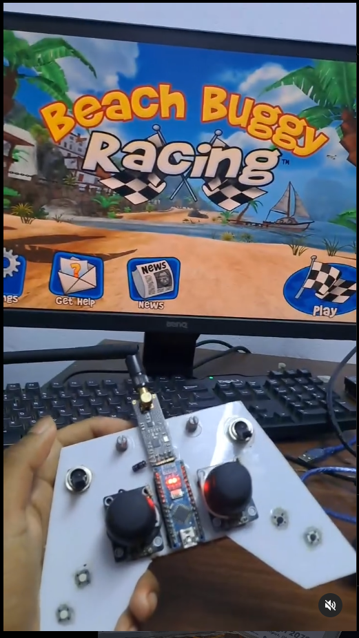
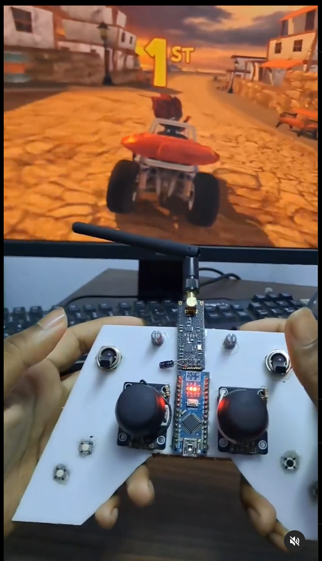

# Custom Wireless Gamepad  

Images
  

Custom Wireless Gamepad with NRF24L01 & Virtual Gamepad Emulation

This repository contains the code for a custom-built wireless gamepad that uses Arduino, joystick modules, potentiometers, switches, and buttons to emulate various gamepad inputs. The gamepad uses two NRF24L01 wireless modules for communication, transmitting data from the gamepad to a receiver Arduino, which then sends the data to a Python script that emulates a virtual gamepad.

**Features:**  
1. 2.4GHZ Wireless communication between the gamepad and the receiver using NRF24L01 modules.  
2. 13 channels of input data, including: Joystick (X, Y axes), potentiometer(for triggers), button states (press/release), switch states (for toggle inputs).  
3. Virtual gamepad emulation in Python using the vgamepad library, allowing the custom gamepad to be recognized as a standard gamepad by the system.  
4. Low-latency(<5ms) communication for real-time gaming applications.    
5. Gamepad range (0.5km-1km)     

**Components:**  

**Gamepad (Transmitter):**  

1.Arduino nano   
2.Joystick modules (2)   
3.Potentiometers (2)  
4.Push buttons (5)  
5.Toggle switches (2)  
6.NRF24L01 wireless module  

**Receiver (Receiver Arduino + Python):**  
1.Arduino with NRF24L01 wireless module  
2.Python script to read data from the receiver and emulate a virtual gamepad using the vgamepad library.  

**Dependencies:**  

**Arduino:  **  
-RF24 library for NRF24L01 communication.  

**Python:**  
-vgamepad library for gamepad emulation.  
  Install using: pip install vgamepad  

-pyserial library for serial communication with the Arduino.  
  Install using: pip install pyserial  

**Driver:  **
Install ViGEmBus Driver: [Link](https://github.com/nefarius/ViGEmBus/releases/tag/v1.22.0)  

The emulated gamepad will be recognized by the operating system as a standard gamepad and can be used in games or applications that support gamepad input.
